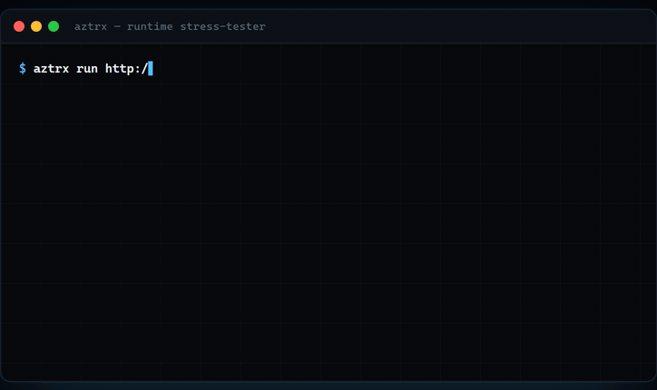

# ⚡ Aztrx

**Find the crash. Prove it. Ship the fix.**

A runtime stress-tester for web apps. Aztrx drives your app like a hostile user, catches the errors your React Error Boundary swallows, maps them back to source lines, and compiles a deterministic Playwright repro so you can watch the bug break again — not read about it in a log line.



---

## Why Aztrx

- **Sees swallowed errors.** Error Boundaries and `window.onerror` miss the errors your app *catches*. Aztrx pulls the real throw-site stack straight off the `Error` object, so a crash you've never seen in your logs becomes a finding you can't ignore.
- **Proves, not reports.** Every crash/error finding ships with an executable `.spec.ts` and a flake-rate verdict — `[deterministic 5/5]`, `[flaky 3/5]`, or `[unreliable]`.
- **Safe by default.** A deny-by-default network guard blocks off-origin calls, and a destructive-action deny-list refuses to click "delete", "pay", or "logout".

## Install

```bash
git clone https://github.com/DanisChaparov/aztrx
cd aztrx
npm install
npm run build
npm link        # puts `aztrx` on your PATH
```

## Quickstart

```bash
cd your-app
aztrx init                                      # scaffold config, gitignore .aztrx/
aztrx run http://localhost:3000                 # deterministic walk
aztrx run http://localhost:3000 --fuzz          # seeded chaos (replayable)
aztrx run http://localhost:3000 --repro         # minimize → compile → validate
aztrx run http://localhost:3000 --fuzz --repro --fail-on   # CI gate: exit 1 on a crash
```

## What it does

1. **Detect** — the CDP interceptor records every action and the ring-buffer recorder captures the console/network/exception surface around it; a classifier dedupes by stack fingerprint. No framework hooks — works on React, Next.js, Vite, Svelte, Remix, Vue.
2. **Locate** — the sourcemap resolver maps minified stacks back to your source lines.
3. **Stress** — the chaos fuzzer drives a seeded, replayable vocabulary far richer than a crawl: clicks, hovers, keypresses, select changes, scrolls, garbage inputs.
4. **Prove** — the ddmin minimizer shrinks the failing sequence, the spec compiler emits a Playwright `.spec.ts`, and the flake-rate validator labels it `deterministic` / `flaky` / `unreliable`.

## The repro is the point

A finding isn't a line in a log — it's a test:

```ts
// .aztrx/repro/520f123d52a0.spec.ts
import { test } from "@playwright/test";

test("reproduces Cannot read properties of undefined (reading 'token')", async ({ page }) => {
  await page.goto("http://localhost:3000");
  await page.getByTestId("checkout").click();
  // …the minimized sequence that crashes it, every time
});
```

Run it to watch the bug break again — deterministically.

## Outputs

- **`.aztrx/report.html`** — offline report with source snippets and repro verdicts.
- **`aztrx studio`** — live dashboard on `localhost:7331`, streaming findings as they land.
- **Ink TUI** — a live terminal panel (effective ops/sec, route status, `[deterministic 5/5]` badges, collapsed noise). Auto-on in a TTY; `--plain` for CI logs.

## Flags

| Flag | What it does |
| --- | --- |
| `--fuzz` | Chaos fuzzing instead of the deterministic walk |
| `--seed <n>` | RNG seed for `--fuzz` (replayable, default `42`) |
| `--repro` | Minimize + compile + validate every finding (ddmin → spec → flake-rate) |
| `--repro-runs <n>` | Replay iterations for the flake-rate gate (default `3`) |
| `--max-actions <n>` | Max actions per pass (default `100`) |
| `--allow-host <host>` | Add a host to the network allow-list (repeatable) |
| `--fail-on` | Exit `1` if any crash/error finding is present — the CI gate |
| `--dry-run` | Report what *would* be clicked, without clicking |
| `--crash-test` | Throw a deliberate error to verify capture |
| `--plain` / `--ui` | Force logs / force the live panel regardless of TTY |

## Security invariants

- **Deny-by-default network** — only the target origin (plus explicit `--allow-host`) is reachable.
- **Destructive-action deny-list** — never clicks delete / pay / logout.
- **`.aztrx/` is gitignored** on `init` — your repro specs and reports stay out of your history.

## Roadmap

- [ ] Cloud dashboard (`api.aztrx.app`) — team run history
- [ ] Closed-loop healing — propose and apply the fix in a sandbox

## License

Apache-2.0 © DanisChaparov
